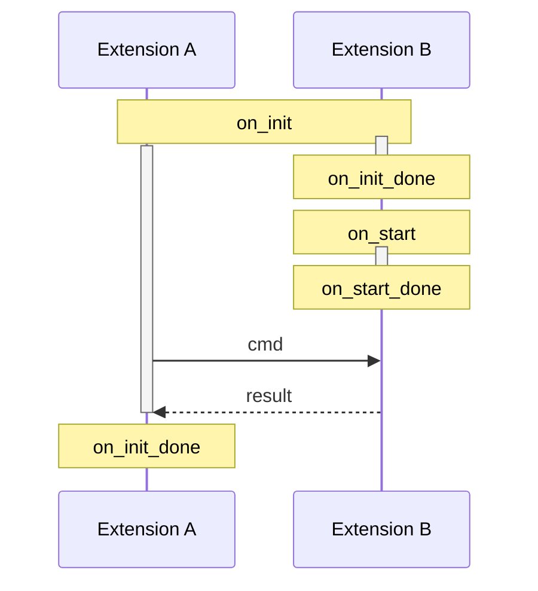

# Page 1

```mermaid
sequenceDiagram
  participant A as Extension A
  participant B as Extension B

  Note over A,B: on_init
  activate A
  activate B
  deactivate B
  Note over B: on_init_done

  Note over B: on_start
  activate B
  deactivate B
  Note over B: on_start_done

  A->>B: cmd
  B-->>A: result

  deactivate A
  Note over A: on_init_done
```

